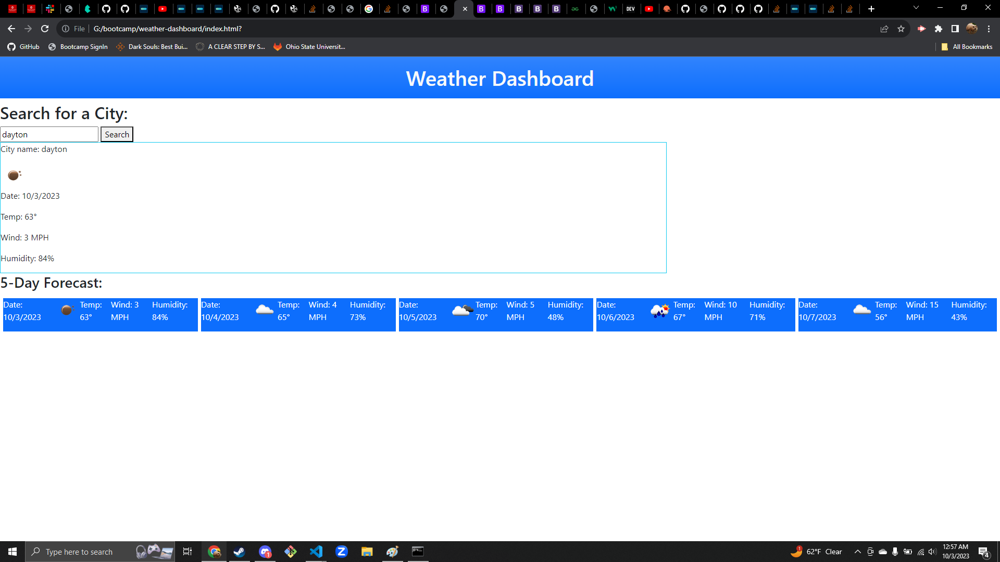

# weather-dashboard

## Description

The webpage will provide weather data for five days for a user searched city.

## Screenshot

## Deployment link:

https://silverfoot42.github.io/weather-dashboard/

##  Credits

I used this resource to help me get the weather icon to appear: https://stackoverflow.com/questions/44177417/how-to-display-openweathermap-weather-icon